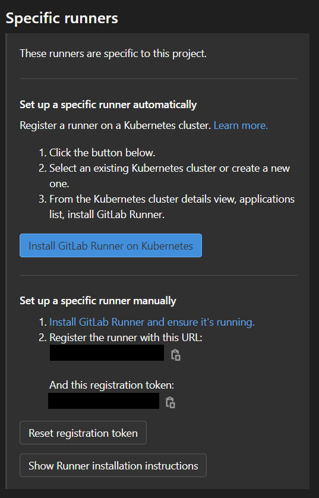

# Installing and using CI/CD
This document will cover how the CI/CD pipeline for this project works, and how you can replicate the steps taken to get it to this point.

# How to setup CI/CD for this project

This project uses [gitlab](https://about.gitlab.com/) for its CI and CD. The following dependencies should be installed:
* [git](https://git-scm.com/download/win)
* [Gitlab runner](https://docs.gitlab.com/runner/install/windows.html)
* [python 3](https://www.python.org/downloads/windows/)
* [Unity (via the unity hub)](https://unity3d.com/get-unity/download)
* [Visual studio 2019](https://visualstudio.microsoft.com/vs/)

This project has been tested with the following versions (note that the project should be compatible with any version afterwards):
* git version 2.28.0.windows.1
* Latest version of the gitlab runner as of 19-04-2020
* python 3.8.3
* Unity 2019.4.21f1
* Visual studio 2019
    * Select the ".NET desktop development" workload

## Installing the gitlab runner
Instructions for installing your gitlab runner can be found in your git repo. 

- Firstly, navigate to your gitlab repo. 
- Go to settings -> CI/CD. 
- Click on "Expand" on the runners 
- follow the instructions under "set up specific runner manually"

<!-- https://stackoverflow.com/questions/14675913/changing-image-size-in-markdown -->

# How the CI/CD pipeline works
The CI/CD pipeline split into 3 tasks:
- Unity unit tests
- Unity production build
- .NET build and test

These first 2 tasks first test the unity project, and then generate an executable for windows.

The ".NET build and test" task first builds an executable and accompanying unit tests, and then runs those unit tests.

# Future improvements
- Gitlab supports parsing unit test results in a JUnit format. Neither of the unit test pipelines currently output that format.
- Test results for SMCLib do not get published as an artifact.
- SMCLib gets built and tested in single step (instead of 2 steps)
- Builds for android seem to be broken (no output gets generated, which causes the pipeline to fail). The task is still present in the .gitlab-ci.yml, but is commented out.
